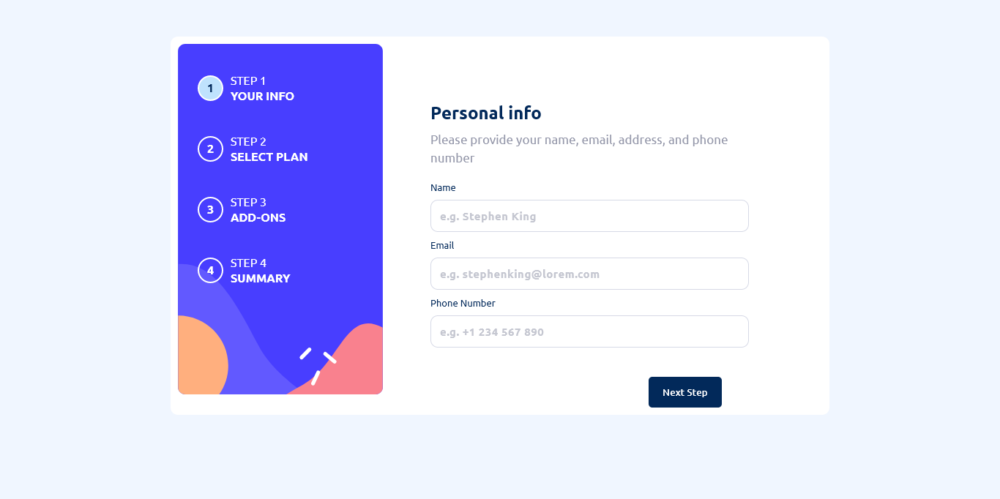

# <h1 align="center">**Multi-Step Form**</h1>

<code>React</code>, <code>Typescript</code>, <code>SCSS</code>, <code>Vite</code>

  <h3>
    <a href="#" color="white">
      Live
    </a>
     | 
    <a href="https://github.com/Ezmad-Ze/multi_step_form">
      Solution
    </a>
    | 
    <a href="https://www.frontendmentor.io/challenges/multistep-form-YVAnSdqQBJ">
      Challenge
    </a>
  </h3>

 
 

## About The Project

The challenge is to build out this multi-step form and get it looking as close to the design as possible.

Users should be able to:

- Complete each step of the sequence
- See a summary of their selections on the final step and confirm their order
- View the optimal layout for the interface depending on their device's screen size
- See hover and focus states for all interactive elements on the page

## Built with

- Semantic HTML5 markup
- CSS custom properties
- Flexbox
- CSS Grid
- Mobile-first workflow
- [React](https://reactjs.org/) - JS library
- [Typescript](https://www.typescriptlang.org/)

## Useful Rescources

- [To update phone input validation](https://tomduffytech.com/how-to-format-phone-number-in-react/)
- [To create multi step form hook](https://www.youtube.com/watch?v=uDCBSnWkuH0)

## Author

- Website - [Ezmad_Ze](https://ezmad.pages.dev/)
- Frontend Mentor - [@yourusername](https://www.frontendmentor.io/profile/yourusername)
